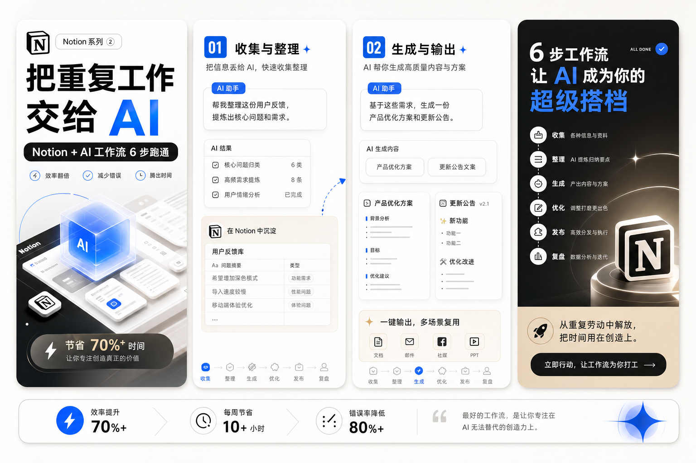

# content-card-maker

一个面向内容创作者的开源 AI Skill。

它不是普通的文案生成器，而是一个真正负责内容拆页、视觉决策、
平台适配、提示词生成和最终交付的 Visual Content Director。

---


## 它解决的不是“写几句文案”

很多创作型 AI 工具只能做到：

- 给你一段标题
- 给你一段正文
- 给你几个标签

但真正的平台图文内容，尤其是小红书图文，不只是“写出来”。

它还需要：

- 先判断内容应该怎么拆
- 先决定封面钩子怎么抓人
- 再决定每一页讲什么
- 再决定整组图应该用什么视觉系统
- 再控制每页的信息密度和手机可读性
- 最后输出可以直接发的平台内容资产

`content-card-maker` 就是为这件事设计的。

## 创作者真正卡住的痛点

很多创作者不是没有内容，而是已经有了一堆素材，却卡在发布前这一步。

常见状态是：

- 已经写了笔记，但不知道怎么拆成图文
- 已经有知识点，但封面总是不够抓人
- 已经有教程，但每一页放什么很混乱
- 已经有产品卖点，但做不成像样的内容资产
- 已经有口播稿或视频提炼，但不知道怎么改成图文卡片
- 已经能写文案，但做不出一整组统一、可发布、可收藏的视觉内容

这个 Skill 解决的就是这段最费时间、最重复、也最影响转化的整理与导演工作。

## 这个 Skill 能做什么

输入任意素材：

- 一篇文章
- 一段笔记
- 一个产品
- 一个视频
- 一个教程
- 一个工作流
- 一个案例

输出一整套可发布内容资产：

- 封面图
- 正文卡片
- 结尾图
- 平台正文
- 标签
- 每页图片 Prompt
- 最终质量检查

如果当前环境有图片生成工具，直接生成成品图。

如果当前环境没有图片生成工具，就生成完整 HTML 图文页并导出 PNG。

## 它是什么

`content-card-maker` 更适合这类工作：

- 你已经有原始内容
- 你希望把内容整理成平台图文
- 你希望 AI 帮你拆页、定节奏、做封面、定风格、出提示词
- 你希望最后拿到的是一整套可发布资产，而不是一段散文案

可以把它理解成：

`source material -> publish-ready visual assets`

## 它不是什么

它当前不是一个“你只给题目，它就从 0 写完整内容”的选题型工具。

也就是说，它不以这些场景为第一目标：

- 只有一个模糊题目
- 还没有任何素材
- 想让 AI 先帮你找选题
- 想让 AI 从 0 写完整稿子再顺便做图

如果只有题目，没有素材，这个 Skill 也许可以给出一个初步方向，
但它最擅长的，依然是整理、重组、导演和视觉化已有内容。

## 当前重点支持的平台

- 小红书
- 小绿书
- 抖音

后续可扩展：

- Instagram
- LinkedIn
- X

## 案例展示

### 1. 健康科普系列


### 2. Notion 系列



### 3. 科技产品系列


## 最适合谁

- 已经有文章、笔记、教程、知识点的人
- 经常需要把长内容拆成小红书图文的人
- 想批量提高内容生产效率的创作者
- 需要把信息做成更容易收藏和传播形式的团队
- 有内容能力，但缺少稳定视觉组织能力的人

## 它的核心能力

### 1. 内容导演能力

不是拿到内容就套模板。

它会先判断：

- 这是什么类型的内容
- 更适合做 list、tutorial、workflow 还是 case-study
- 一共应该拆几页
- 封面应该打什么钩子
- 每页应该放一个什么重点
- 结尾是总结还是 CTA

### 2. 视觉决策能力

不是简单做 Topic -> Style 的映射。

它会综合判断：

- Topic
- Secondary Topic
- Platform
- Audience
- Content Type
- User Goal
- Information Density
- Emotional Tone

然后输出：

- Primary Style
- Secondary Style
- Layout Direction
- Color Direction
- Typography Direction
- Illustration Direction
- Strategy Reason

### 3. 平台适配能力

不同平台不只是尺寸不同，内容节奏也不同。

这个 Skill 会针对平台处理：

- 封面规则
- 标题规则
- 图片数量
- 正文写法
- CTA 写法
- 不该出现的表达方式

### 4. 交付能力

默认不会停留在“分析一下”。

只要用户说的是“做图文”，它就应该继续往下生成：

- 封面
- 正文卡片
- 结尾卡
- 提示词
- 成品图或导出图

只有用户明确说 `只要文案` 或 `只要文字`，才允许纯文字输出。

## 为什么它和一般 Prompt 项目不一样

这个项目不是一个超长 Prompt。

它是模块化架构。

`SKILL.md` 不负责把所有逻辑写死在一个文件里，而是只做调度。

真正能力拆在不同模块中，方便以后继续扩展、维护和开源协作。

## 项目结构

```text
content-card-maker/
├── README.md
├── SKILL.md
├── CARD_PLANNER.md
├── VISUAL_ENGINE.md
├── STYLE_LIBRARY.md
├── LAYOUT_LIBRARY.md
├── PLATFORM_RULES.md
├── PROMPT_ENGINE.md
├── OUTPUT_FORMAT.md
├── QUALITY_CHECK.md
└── examples/
```

## 模块职责

### `SKILL.md`

整个 Skill 的 orchestrator。

负责：

- 接收用户输入
- 调用各模块
- 判断交付路径
- 输出最终结果

### `CARD_PLANNER.md`

负责内容拆页和叙事节奏。

决定：

- 内容模式
- 总页数
- 页面顺序
- 封面策略
- 结尾策略
- 每页主信息
- 每页信息密度

它不选风格，也不写最终 Prompt。

### `VISUAL_ENGINE.md`

负责视觉策略决策。

不是粗暴映射，而是一个 decision engine。

### `STYLE_LIBRARY.md`

负责可复用 Style Preset Library。

例如：

- Health Clean
- Apple Tech Minimal
- Business Editorial
- Study Notes
- Warm Lifestyle
- Notion Clean
- Growth Playbook

### `LAYOUT_LIBRARY.md`

负责可复用页面布局系统。

例如：

- Hero
- Checklist
- Numbered List
- Comparison
- Timeline
- Flowchart
- Grid Cards
- Notebook
- Editorial

### `PLATFORM_RULES.md`

负责平台原生规则。

当前支持：

- 小红书
- 小绿书
- 抖音

### `PROMPT_ENGINE.md`

负责把下面这些信息合成稳定的每页生图 Prompt：

- Visual Strategy
- Style Library
- Layout Library
- Card Planner
- Platform Rules

### `OUTPUT_FORMAT.md`

负责定义固定输出结构。

### `QUALITY_CHECK.md`

负责最后一轮质量检查。

## 默认工作流

```text
User Input
↓
Content Analysis
↓
CARD_PLANNER
↓
VISUAL_ENGINE
↓
STYLE_LIBRARY
↓
LAYOUT_LIBRARY
↓
PLATFORM_RULES
↓
PROMPT_ENGINE
↓
OUTPUT_FORMAT
↓
QUALITY_CHECK
↓
Final Output
```

注意：

- `Content Analysis` 默认是内部步骤
- 对用户的最终展示，不应优先铺大段分析
- 应优先展示成品、预览图、导出图或交付链接

## 固定输出结构

最终输出固定为以下 8 个部分：

1. Final Assets
2. Visual Strategy
3. Card Plan
4. Card Structure
5. Image Prompt
6. Publishing Caption
7. Hashtags
8. Quality Review

这三者不能混：

- `Card Plan` 是叙事逻辑
- `Card Structure` 是最终可读文案
- `Image Prompt` 是生图指令

## 质量标准

这个项目不是“能生成就算完成”。

最终结果至少要检查：

- 视觉一致性
- 平台一致性
- Card Planning Quality
- 标题质量
- 图片可读性
- 手机阅读体验
- 封面吸引力
- 结尾 CTA
- Prompt Quality
- Prompt Completeness
- Delivery Completeness
- Sample-to-Output Consistency

## 一个非常重要的原则

如果已经先给用户看过样片、预览图或者风格参考图，
最终产出不能和样片差很多。

这不是建议，是硬要求。

需要保持接近的内容包括：

- 配色气质
- 字体感觉
- 构图节奏
- 完成度
- 系列统一性

样片不是“随便看看”，而是风格承诺。

## 适合谁用

- 小红书创作者
- 知识博主
- 教程作者
- 产品营销内容团队
- 内容工作室
- 需要把长内容拆成图文资产的人

## 使用方式

把这个 skill 放进 Codex skill 目录后，可以直接用自然语言调用，例如：

```text
用 content-card-maker 把下面内容做成小红书图文：
[你的内容]
```

或者：

```text
请把这个教程做成一套适合小绿书发布的图文卡片
```

如果你明确只要文字，可以这样说：

```text
只要文案，不要出图
```

## 开源方向

这个项目后续可以继续扩展：

- 更多 Style Preset
- 更多 Layout Preset
- 新的平台规则
- 更强的 Prompt Engine
- 更丰富的 examples
- 更稳定的视觉生产链路

它的目标不是做成一个一次性 Prompt，
而是做成一个真正可维护、可协作、可持续升级的开源 Skill。
